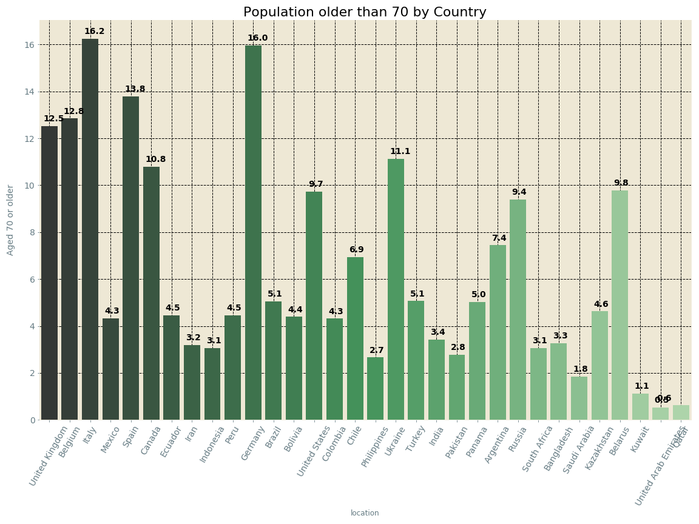
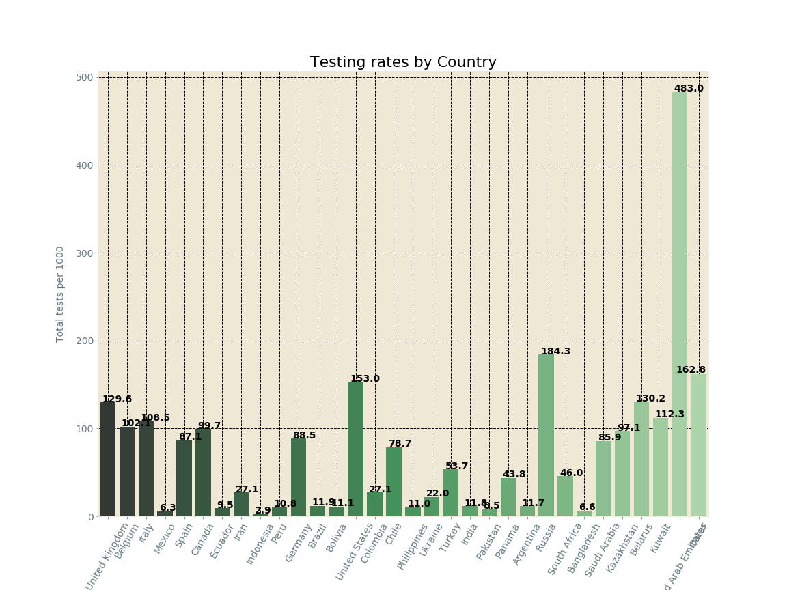

#   Creation of an EDA Covid app and Exploratory Data Analyses of Covid Data.

Coronavirus disease 2019 (COVID‑19) is an infectious disease caused by severe acute respiratory syndrome coronavirus 2 (SARS-CoV-2). It was first identified in December 2019 in Wuhan, Hubei, China, and has resulted in an ongoing pandemic. As of 15 August 2020, more than 21.1 million cases have been reported across 188 countries and territories, resulting in more than 765,000 deaths. More than 13.2 million people have recovered.
The spread of this virus is currently accelerating globaly; hence it is importance to better understand its behaviour-spread.

In this notebook I focused on analyzing covid data in an effort to better understand the main factors that drive the spread of Covid.

### Code and Resources Used

**Python Version**: 3.7

**Packages**: pandas, numpy, matplotlib, seaborn, bokeh, streamlit, collections, base64, PIL, datetime, sklearn and plotly.

**Data sources**: Data was obtained from the [our world in data](https://ourworldindata.org/coronavirus-source-data) and [world o meters](https://www.worldometers.info/coronavirus/) websites.

---

## Covid EDA app:

I built locally an app with the [Streamlit](https://streamlit.io/) package and deployed it using the [Heroku](https://dashboard.heroku.com/apps) framework. 

Click **[here](https://st-covid-eda.herokuapp.com/)** to give it a try.

There are a total of **5 types of plots** that can be used in the app to visualize the evolution of the pandemia:

**1) Date-Line Plot**: A linear graph that shows parameter frequencies along the date

**2) Scatter-Plot**: Plot to study the relactionship between parameters.

**3) Bar-Plot**: This plot displays the most recent data of a parameter (Y axis) of choice for each country (X_axis).

**4) Map-Plot**: This plot displays the evolution overtime of a parameter (Y axis) on a map plot of the selected countries.

**5) Bubble-Plots**: This is a nice plot to observe the evolution of the pandemia. It plots the total_cases_per_million (X axis) vs the total_deaths_per_million overtime for each country.

---

## Exploratory Data Analyses (Aug-2020):

[**See project here**](https://nbviewer.jupyter.org/github/EnriqueSPR/covid_EDA_project/blob/master/covid_EDA_project.ipynb)

Below I include few highlight figures.

* Histograms showing the distribution of the different variables in the data set:
 

* Diagram showing the correlations among all the variables in the data set:

* Plots showing the number of cases per million and the number of tests per 1000 reported in each continent daily:

   

* Plots showing the top 10 countries affected in the world by cases and deaths reported so far:

   

* Plots showing the top 5 countries affected in the world by cumulative cases and deaths every 2 weeks:

   

* Plots showing the top 10 countries testing more in the world by cumulative cases and deaths every 2 weeks:

   

* Plots showing the death rates, the percentage of population older than 70 and the testing rates by country:

 

* Screenshots of the interactive plots generated with Bokeh and Plotly:

### Conclusions: 
In this exploratory data analysis of Covid Data we have extracted some valuable information on the factors driving the spread and negative impact of this virus
* Older people seem to be more susceptible to the virus.
* Countries with higher testing rates are controlling better the stread of covid. Scaling-up testing quickly at the beginnnig seems to be a critical factor in order to be able to control the pandemia.
* The GDP per capita, hadwashing facilies and number of beds at hospitals seem to be critical also factors for Covid control. In fact, these variables undoubdtely greatly contribute a stronger health-care system which in turn allowed a quicker and more effective response.
* The larger percentage of men death rates compared to women remains a matter of discussion. The higher rate of male smokers may make men more susceptible to the disease.
* The pandemia seems to be accelerating in the american continent, where policies have been somewhat more relaxed. The opposite tendecy is taking place in Europe. This comes to show the importance of following the advices from health authorities from the use of the mask, practicing social distancing and washing hands.
* Currently, the most affected countries seem to be USA, Colombia, South Africa, India, Mexico, Brazil and Peru as the recovery rates and increases in cases per million in last 2 weeks show.

### Forecast: 

The low testing rates of highly populated countries such as India will make very difficult to control this virus, since it has been shown that most of the people (in particular of young age) remain assimptomatic but infectious. Hence, the countries at highest risk in the weeks to come are those:

* High populated.
* With low median-age.
* With low testing rates.

Hence, it is expected that the health impact in the coming weeks will be greatest in Colombia, South Africa, India, Brazil, Mexico, Peru and USA.

